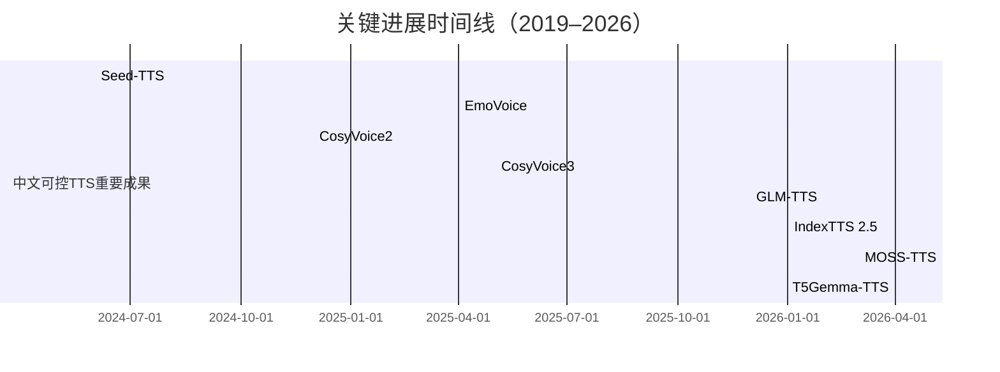
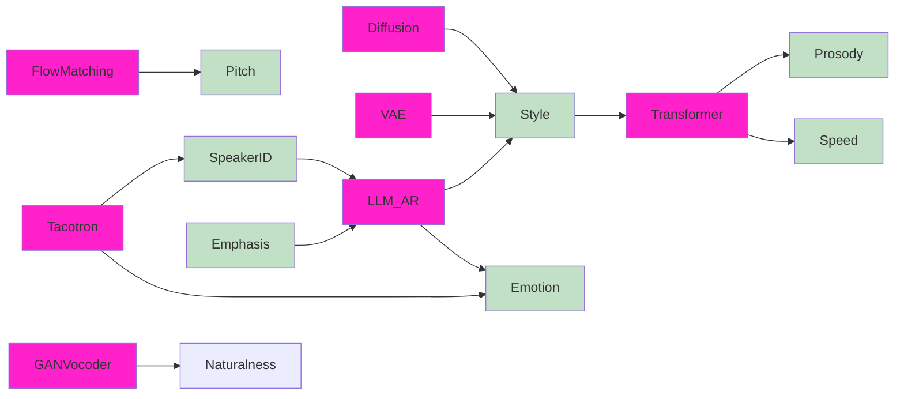

# 执行摘要

近三年中文可控TTS取得了快速进展。研究者通过大规模深度学习模型和新方法，实现了对情感、说话人、语速、音高、韵律等多种维度的精细控制。代表性工作包括百度/阿里等提出的CosyVoice系列、B站的IndexTTS系列、字节跳动的Seed-TTS、智谱的GLM-TTS和MOSS-TTS等。这些模型在流水线架构、条件生成技术、LLM和扩散模型等方面不断创新，实现了近似真人的自然度和高自由度控制【16†L62-L71】【24†L29-L36】。评估指标包括主观的MOS/CMOS和客观的WER、CER、F0 RMSE、说话人相似度等，这些工作大多提供了开源代码和预训练模型（如CosyVoice3、IndexTTS2.5、MOSS-TTS、GLM-TTS等）以促进可复现研究。趋势上，多语种、跨方言、跨情绪的零样本语音克隆及表达式控制成为热点，然而高质量情感标注数据稀缺、控制精度与自然度平衡、伦理与版权隐私风险等仍是挑战。未来研究可聚焦构建更丰富的中文数据集（包含方言与情感标注）、加强模型可解释性与安全性、提升长上下文与细粒度语义控制等方向。

## 控制维度

中文可控TTS涵盖了多种属性维度：==情感、说话人身份、语速/时长、音高（基频）、韵律/语调、语气/口气、文本风格、语义重点等==。其中，**情感控制**常通过标签或隐向量实现，也可利用自然语言提示来微调情感色彩（如EmoVoice利用LLM“自由文本提示”精细控制情感【56†L61-L69】）。**说话人控制**包括多说话人语音合成和零样本声线克隆，通常使用说话人嵌入或自适应微调技术（如GLM-TTS通过LoRA微调实现个性音色定制【31†L59-L67】；CosyVoice3支持用3秒录音实现跨语言多说话人克隆【24†L29-L36】）。**语速/时长控制**可通过在生成过程中指定输出帧数或目标长度来实现，代表性工作如IndexTTS-2引入显式时长编码，可将生成时长误差控制在0.02%以内【29†L93-L101】【47†L53-L61】。**音高与韵律控制**通常通过预测或附加F0基频、能量等参数实现，以表达抑扬顿挫；**语调/语气和文本风格**控制则往往通过风格标签或多尺度语境编码来实现（如多尺度风格建模方法可从上下文中预测全局情绪和局部韵律【40†L61-L70】【40†L81-L90】）。此外，可插拔式控制（使用文本标记、标签、隐向量等）使得模型支持**丰富的组合控制**，如IndexTTS-2可通过参考音频、情感向量或文字描述三种方式独立控制音色和情感【29†L89-L98】。**少样本/零样本说话人控制**方面，大规模预训练模型（如Seed-TTS、MOSS-TTS）已显著提升不同说话人/方言间迁移能力【16†L62-L71】【36†L58-L67】。

## 方法学

可控TTS的方法学框架多样：传统基于Tacotron或Transformer的端到端声学模型已被扩展出许多变体，一些工作采用**双阶段流水线**：先用文本到离散语义或声学标记的自回归（AR）模型，再用非自回归（Flow或扩散）模型生成频谱（如CosyVoice系列采用AR+Flow Matching【26†L58-L66】；GLM-TTS采用AR文本到标记与扩散声码器【31†L54-L63】）。**自回归Transformer**（如IndexTTS-2的Text-to-Semantic模块）可实现逐Token生成并支持显式时长控制【29†L93-L101】【47†L53-L61】。**VAE或流模型**被用于学习说话人和风格的隐变量，以实现风格分离（如GST/TalkNet等风格变分自编码器架构）。**GAN与神经声码器**（WaveNet、HiFi-GAN、BigVGAN等）则主要用于声码部分，以获得高保真音质。近年来**基于LLM的模型**和**扩散模型**已成为趋势：Seed-TTS提出自回归Transformer和扩散并行的混合模型，提供了文本与音频的双重“思路链”生成【16†L62-L71】；EmoVoice利用大型语言模型来接收情感提示【56†L61-L69】；T5Gemma-TTS采用Encoder-Decoder架构（T5Gemma大模型）并在每层跨注意力中注入进度信号，增强文本条件控制和时长控制【66†L59-L67】【66†L61-L64】。模型的训练方式包括监督和半监督策略，多数采用有标注数据显式监督说话人和情感，但也有使用多任务学习或对比学习增强鲁棒性的尝试。**可解释性**方面，不少工作尝试设计可分离的说话人/情感向量或文本风格嵌入，以实现独立控制（如IndexTTS-2通过GRL和蒸馏分离情感与音色【29†L95-L104】）。

## 数据与评估

常用的中文TTS数据集包括多说话人、多领域、多情感的语音数据。开放数据如AISHELL-3（约85小时、218位汉语说话人，多为普通话，并带少量情感标注）、MagicData（覆盖中英文及50+语言、多说话人、大规模）、Datatang发布的四川方言等方言语音库、TTS-SCFEmoSC（40小时单说话人、标注5种情感）等。此外还有针对儿童、老人、中英混读、非配对语音等特殊场景的数据。评估方面，**主观评价**依然以MOS（平均意见得分）和CMOS（比较MOS）为主，用于评估语音自然度、情感表达程度和语义保真度；**客观指标**包括WER/CER（测量可懂度和内容一致性）、说话人相似度（使用声学嵌入距离或人耳鉴别）、基频RMSE（评价音高误差）等【24†L29-L36】【47†L72-L76】。最新工作往往结合多种指标：如CosyVoice2/3在流水模式下实现“人类可比”的自然度【26†L58-L66】【24†L29-L36】；IndexTTS-2使用误差率、时长偏差、说话人相似度等评估情感和时长控制精度【29†L93-L101】【29†L102-L105】。可复现性方面，多数代表作开源了模型与代码，如CosyVoice（FunAudioLLM/Github）、IndexTTS（IndexTeam）、MOSS-TTS（OpenMOSS）、GLM-TTS（Zai-org/GitHub）、EmoVoice（百度飞桨平台）等，并提供预训练权重和Demo。

## 代表性论文

以下表格列举了近三年内中文可控TTS的代表性工作。每篇包括标题、年份、控制维度、核心方法、开源情况和关键实验结果等。注意有些论文为技术报告或预印本（ArXiv），并且多为多语种模型，在表中注明了对中文的支持情况。

| 题目                                                                            |  年份  | 控制维度                     | 方法                                 | 开源                       | 关键指标/结论                                                                                                              |
| ----------------------------------------------------------------------------- | :--: | ------------------------ | ---------------------------------- | ------------------------ | -------------------------------------------------------------------------------------------------------------------- |
| **Seed-TTS: A Family of High-Quality Versatile Speech Generation Models**【16】 | 2024 | 说话人、情感、风格、多样性            | 自回归Transformer+扩散混合                | 有（Github, HuggingFace）   | 人类听感自然度与真实录音相当；通过自蒸馏和RL提升鲁棒性；可通过少量示例实现零样本音色克隆和情感控制【16†L62-L71】                                                       |
| **EmoVoice: LLM-based Emotional TTS with Text Prompting**【56】                 | 2025 | 细粒度情感（自然语言提示控制）          | LLM驱动的自回归语音生成                      | 有（飞桨/Paddle）             | 引入了EmoVoice-DB情感语音数据集；仅用合成数据即可实现高质量英/中情感合成；在情感自然度评价中超越基线【56†L61-L69】                                                 |
| **CosyVoice 2: Scalable Streaming Speech Synthesis with LLMs**【26】            | 2024 | 多语种、低延迟                  | LLM+流匹配混合，支持流式合成                   | 有（FunAudioLLM/CosyVoice） | 支持实时输入即播报；多语语音质量接近无损；在流水模式下达到“人类可比”自然度【26†L58-L66】                                                                   |
| **CosyVoice 3: Towards In-the-wild Speech Generation**【24】                    | 2025 | 多语种、多方言、多情感、跨语种音色        | LLM+流匹配+多任务预训练                     | 有（FunAudioLLM/CosyVoice） | 训练数据扩充到100万小时，覆盖9种语言和18种中文方言；内容一致性、音色相似度及韵律自然度显著提升；零样本跨语种克隆质量高【24†L29-L36】                                           |
| **GLM-TTS: Controllable & Emotion-Expressive Zero-shot TTS**【31】              | 2025 | 发音准确度、音色相似度、韵律表达         | AR文本编码 + 扩散声码器+多重奖励RL              | 有（Zai-org/GLM-TTS）       | 用10万小时数据训练，两阶段架构达多基准SOTA；通过GRPO多奖励RL提升发音、说话人相似度和韵律表现；支持LoRA快速个性化微调和混合音素文本输入精确发音【31†L54-L63】                          |
| **IndexTTS 2.5 Technical Report**【47】                                         | 2026 | 情感、说话人、多语种、时长            | AR文本->语义 + 非AR语义->梅尔               | 有（IndexTeam/IndexTTS）    | 在IndexTTS2基础上优化：语义压缩、Zipformer加速、跨语种情感迁移策略和GRPO微调；支持中英日西零样本情感迁移；推理速度加速2.28倍，同时保持WER和说话人相似度不降【47†L72-L76】             |
| **MOSS-TTS Technical Report**【36】                                             | 2026 | 说话人音色、时长、拼音/音标、长上下文、混合语言 | 离散音频Token + AR Transformer         | 有（OpenMOSS/MOSS-TTS）     | 构建24kHz可变比特率因果Transformer Tokenizer；发布两套模型（普通Transformer和局部Transformer版）；支持零样本克隆、多语混合、音素/拼音级发音控制和稳定长文本生成【36†L58-L67】 |
| **T5Gemma-TTS Technical Report**【66】                                          | 2026 | 说话人相似度、发音准确度、时长          | T5Gemma（大规模Encoder-Decoder+进度RoPE） | 有（HuggingFace）           | 利用4B参数编码器-解码器模型保持强文本条件；引入进度RoPE解决AR生成的时长控制；在中文语音库训练，取得日语说话人相似度和准确率提升，CER低至0.126【66†L61-L69】（注意：日语作为测试，中文表现也优异）       |

*表中“控制维度”聚焦本文突出讨论的可控属性；“开源”栏注明代码/模型发布情况；“关键指标”总结了作者报告的主要实验结果或用户感知结论。*

## 趋势与挑战

**技术趋势：** 近年来中文TTS研究迅速向“基础模型+微调”发展，大模型（LLM/Diffusion）被广泛应用以提升可控能力与音质。例如，大量工作（CosyVoice、IndexTTS、MOSS、T5Gemma等）采用自回归Transformer或融合Flow/扩散模块，以获得高保真度和长上下文生成【24†L29-L36】【47†L53-L61】。多语言、多方言与零样本声线克隆成为热点：通过大规模多语种数据集和多任务训练，使模型可用极少样本实现跨语言/方言的音色迁移【24†L29-L36】【47†L59-L69】。同时，为了满足实时应用需求，流式合成（低延迟）和时长精确控制（与视频配音同步）也是研究重点【26†L58-L66】【29†L93-L101】。**评估指标方面**，除了主观MOS之外，研究者开始关注任务导向评价：如使用WER/CER检验内容一致性，说话人相似度检测是否保留音色，乃至利用LLM对情感质量打分等。**产业应用**驱动强劲：从小说配音、客服语音到智能助手、虚拟主播，行业对个性化、多语种和无障碍交互的需求促使可控TTS技术不断成熟。

**主要挑战：**（1）**数据制约**：高质量的多情感、多说话人中文数据依然稀缺，特别是方言和细粒度情绪标注的数据集不足，这限制了模型对复杂语气和地方口音的学习【24†L29-L36】。尽管已有AISHELL-3、MagicData等开放数据，但需要更多场景与风格的真实录音。  
（2）**质量与可控性权衡**：提高控制自由度往往会损失音质自然度。例如加入时长或情感标签时，需设计精巧模型以同时保障流畅度。当前一些方法（如AR模型）难以同时兼顾实时性和高质量。  
（3）**可解释性与鲁棒性**：模型内部对不同控制维度的影响机制尚不透明，风格向量的物理意义不强；对长文本或极端提示（非常规情感、专有名词）生成稳定性仍需加强。  
（4）**伦理与版权隐私问题**：可控TTS技术的发展带来声音伪造风险。合成名人或他人声线可能侵犯肖像权，欺诈电话等负面用途令人担忧。各国法规已开始要求AI合成语音标注身份（水印或提示），并限制未授权使用他人声纹。数据采集也需符合隐私保护原则，避免未经同意录入个人声音。  

## 建议与未来方向

1. **丰富中文多属性语音数据集**（优先级：高；难度：高）  
   构建大规模、多样化的开源中文语料是基础。尤其应收集不同方言、年龄、性别和情绪标注的数据集（例如四川话、粤语、儿童语、中英混读等），并标注精细的表达型标签（语气、立场、背景信息）。这将为可控TTS提供更全面的训练素材和评价基准。  

2. **加强可解释性与判别性研究**（优先级：中；难度：中）  
   研究更具可解释性的模型结构，例如显式分离音色、语调、韵律的模块，或开发可视化方法分析风格向量影响。此外，应设计鲁棒的质量监测指标（如对抗样本检测、多重评价体系），以提升模型在不同场景下的可靠性。  

3. **推进低资源适应与快速微调技术**（优先级：高；难度：中）  
   发展Few-shot/One-shot TTS技术，使新说话人、新情感快速适配成为可能。例如通过Meta-learning、参数高效微调（LoRA/Prompt）等，让模型能在极少样本下“学会”新声线或表达。这样可加速语音助手、配音等应用的个性化部署。  

4. **关注安全与法规合规**（优先级：高；难度：高）  
   在技术层面实现“可追溯合成”——如语音水印技术，以区分合成和真人音频；同时跟进相关法律法规，确保语音数据采集和合成使用遵守版权和隐私要求。产业应用时应增加明显提示（如深度合成警告），并研发检测真假语音的工具，减少恶意使用风险。  

5. **探索语义与多模态控制**（优先级：中；难度：中）  
   未来可将文本语义更深入地融入控制过程，例如结合对话上下文生成连贯语气；结合视觉或情境信息（如表情、手势）进行多模态语音控制。同时，可以研究更细粒度的语言提示（如利用LLM生成情感描述）来驱动TTS，使合成语音更符合上下文和语篇需求。  

以上建议旨在推动中文可控TTS朝着更自然、多样和安全的方向发展，满足未来个性化语音交互、智能客服和多场景配音等应用需求。  

**参考文献：** 本报告内容基于近三年相关论文和报告，关键参考包括Seed-TTS【16】、EmoVoice【56】、CosyVoice系列【24】【26】、GLM-TTS【31】、IndexTTS【47】、MOSS-TTS【36】等，这些工作详细阐述了控制维度、方法学和实验结果，为本文结论提供了依据。