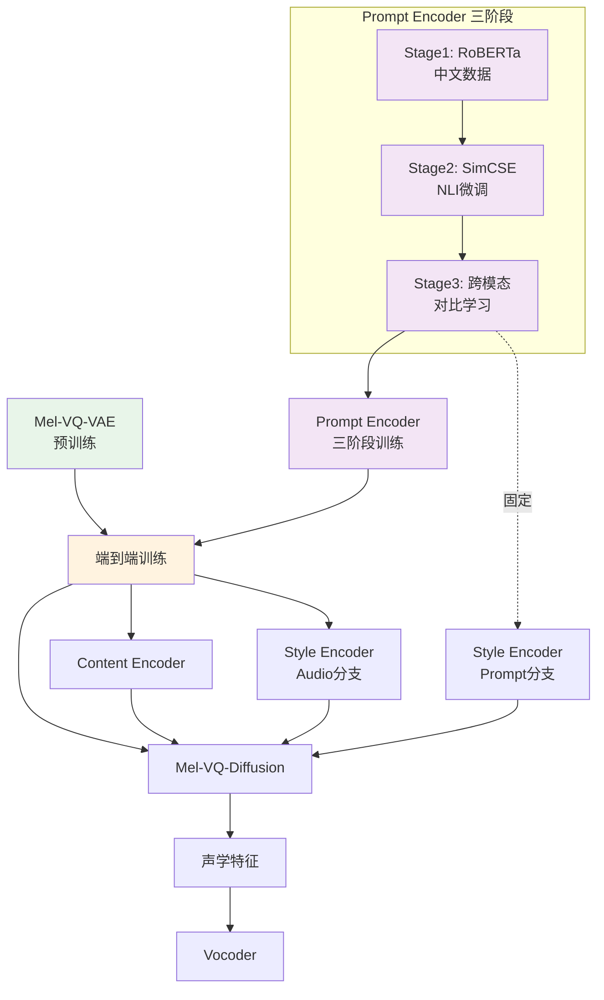

### 1. **title** && **abstract**

**Abstract**:
**表达性文本转语音（Expressive TTS）** 旨在合成具有多样说话风格的语音，以更好地反映人类语音模式。
==本文首次尝试使用**自然语言风格提示（Natural Language Style Prompt）** 来控制合成语音的风格。==

本文首先构建了一个**NLSpeech数据集**（中文，44小时，32K条，7说话人），每条语音样本不仅包含内容转录，还包含自然语言风格描述。

然后提出了InstructTTS模型，其创新点包括：

1. **三阶段训练策略**：利用自监督学习和跨模态度量学习，获得能够从风格提示中捕获语义信息的鲁棒句子嵌入模型
2. **离散潜在空间建模**：在离散潜在空间中对声学特征进行建模，训练离散扩散概率模型生成向量量化（VQ）声学token，而非传统的mel谱图
3. **互信息最小化**：联合应用互信息估计和最小化，避免风格提示中的内容和说话人信息泄露

---

### 2. **intro**
#### 研究背景与动机

| 方法类型       | 局限性                        |
| ---------- | -------------------------- |
| **类别标签**   | 只能生成预定义的几种风格，表达能力有限        |
| **参考语音模仿** | 风格信息难以解释，难以找到精确匹配用户需求的参考语音 |

#### **面临挑战**
本文首次研究使用**长且复杂的自然语言提示**来控制说话风格，面临两大挑战：
1. 如何训练语言模型从自然语言提示中捕获语义信息并控制合成语音的说话风格
2. 如何设计声学模型有效处理表达性TTS的"一对多"学习问题

#### 主要贡献
1. **首创性**：首次研究使用自然语言提示词进行表现力TTS建模 。
2. **句子嵌入模型**：提出三阶段训练策略，获得稳健的句子嵌入模型以捕获提示词的语义信息。
3. **离散扩散模型**：在离散潜在空间中建模声学特征，训练新颖的离散扩散模型生成VQ声学特征，将TTS转化为Seq2Seq的语言建模任务 。
4. **特征探索**：探索了基于梅尔频谱和基于波形的两类VQ特征。波形建模方法仅需一阶段训练，且是非自回归模型 。
5. **互信息（MI）最小化**：联合应用互信息估计与最小化，防止提示词中的"内容"和"说话人"信息泄露到生成的语音中 。

---

### 3. **method**

#### 3.1 系统架构概述

InstructTTS整体架构包含五个核心组件：
![[Pasted image 20260408141807.png|397]]
**Figure 1(a): InstructTTS整体架构**
- **Content Encoder（内容编码器）**：从内容提示（音素序列）中提取内容表示
- **Style Encoder（风格编码器）**：从风格提示或参考mel谱图中提取风格特征
- **Speaker Embedding（说话人嵌入）**：通过查找表获取说话人特征
- **SALN Adaptor（风格自适应层归一化适配器）**：将风格信息注入TTS模型
- **Discrete Diffusion Decoder（离散扩散解码器）**：生成VQ声学token

![[Pasted image 20260408141915.png|316]]
**Figure 1(b): Style Encoder细节**
- **Prompt Encoder**：预训练的RoBERTa模型，从风格提示提取嵌入
- **Adaptor Layer**：将提示嵌入映射到新的潜在空间，将提示嵌入映射与音频嵌入对齐
- **Audio Encoder**：从参考mel谱图提取风格信息（训练时使用）

![[Pasted image 20260408142116.png|315]]
**Figure 1(c): Mel-VQ-Diffusion细节**
- 基于Transformer的离散扩散模型
- 输入：带噪声的mel谱图token、条件信息（内容+风格+说话人）
- 输出：预测的干净mel谱图token

#### 3.2 训练阶段一：VQ-VAE与神经音频编解码器预训练

在训练InstructTTS主模型之前，需要先预训练向量量化模型，将连续声学特征转化为离散token。
**预训练数据**：669小时语音数据（内部数据集300h + VCTK + AISHELL3 + LibriTTS）

![[Pasted image 20260408151834.png|414]]

**Mel-VQ-VAE预训练**：
- 输入：log mel谱图（80维，帧移240点，采样率24kHz）
- 编码器下采样：时间维度×2，频率维度×20
- Codebook：大小K=512，维度n_z=256
- 量化公式：$z_q = Q(\hat{z}) := \arg\min_{z_k \in Z} ||\hat{z}_{ij} - z_k||_2^2$
	- [i] 拿着编码器刚算出来的新特征，去密码本里挨个对比，谁跟它最像（距离最近），就用谁来代替它
- Discriminator：使用对抗损失提升重建质量（类似VQ-GAN）

![[Pasted image 20260408152003.png|390]]
**神经音频编解码器预训练**：
- 探索三种量化技术：RVQ（残差向量量化）、GVQ（分组向量量化）、GRVQ（分组残差向量量化）
- RVQ使用最多12个codebook，GVQ/GRVQ使用4个codebook
- 帧移10ms，即1秒音频对应100帧
- 每个codebook包含1024个码字

#### 3.3 训练阶段二：风格提示嵌入模型（三阶段训练）
为使模型能够从自然语言风格提示中提取语义信息，需要对**Prompt Encoder**进行三阶段训练。

**目标**：获得高质量的风格提示嵌入，需满足：
1. 包含重要的语义信息
2. 分布均匀平滑，能泛化到训练时未见过的风格描述

**阶段2.1：训练中文基础语言模型**
- 由于开源预训练语言模型多为英文，首先在中文数据上训练RoBERTa模型
- 获得基础中文语言理解能力

**阶段2.2：在标注数据上微调（SimCSE）**
- 使用中文自然语言推理（NLI）数据微调
- 采用SimCSE策略，使用InfoNCE损失优化
- 目标：学习更好的句子语义表示

**阶段2.3：跨模态表示学习（Figure 2）**

![[Pasted image 20260408142330.png|380]]

**Figure 2: 跨模态表示学习架构**
- 对比学习
- 使用**InfoNCE损失**（比对比排序损失效果更好）
- ==目标：将风格提示嵌入和音频表示映射到共享的语义空间（对齐文本和语音风格空间）==

关键设计：
1. **超球面约束**：将嵌入约束在语义超球面上，有助于统一文本和音频的模态差异，提升嵌入的判别性和泛化能力
2. **双向检索训练**：既做"文本→音频检索"也做"音频→文本检索"，增强跨模态对齐的鲁棒性

三阶段训练完成后，Prompt Encoder参数被**冻结**，在InstructTTS主模型训练中固定使用。

#### 3.4 训练阶段三：InstructTTS主模型端到端训练

在完成上述两个预训练阶段后，开始训练InstructTTS主模型。
![[Pasted image 20260408151526.png]]

**各组件状态**：

| 组件 | 状态 | 说明 |
|------|------|------|
| VQ-VAE/Codec Encoder | **冻结** | 阶段一预训练得到 |
| Prompt Encoder | **冻结** | 阶段二三阶段训练得到 |
| Audio Encoder | **训练** | 学习从mel谱图提取风格特征 |
| Content Encoder | **训练** | 从音素序列提取内容特征 |
| Discrete Diffusion Decoder | **训练** | 生成VQ声学token |
| Speaker Embedding | **训练** | 说话人查找表 |

**训练目标**：

$$L = L_{diff} + L_{var} + \lambda_1 I(z_e; c) + \lambda_2 I(z_e; z_{sid}) + \lambda_3 D_{Euc}(z_p, z_e) - \beta_1 F_1(\theta_1) - \beta_2 F_2(\theta_2)$$

各项含义：
- $L_{diff}$：扩散损失（VLB，变分下界）
- $L_{var}$：时长、音高、能量预测损失
- $I(z_e; c)$：风格-内容互信息（使用CLUB上界估计）
- $I(z_e; z_{sid})$：风格-说话人互信息（使用CLUB上界估计）
- $D_{Euc}(z_p, z_e)$：提示嵌入与音频嵌入的L2距离
- $F_1(\theta_1), F_2(\theta_2)$：互信息近似模型的似然（用于CLUB估计）

**关键训练细节**：
1. **互信息最小化（MIM）**：使用CLUB方法估计互信息上界并最小化，确保Audio Encoder只编码风格信息，不泄露内容和说话人信息
2. **提示-音频对齐**：最小化$z_p$（提示嵌入）与$z_e$（音频嵌入）的L2距离，使两者在共享语义空间中接近
3. **Classifier-Free Guidance训练**：10%概率使用可学习的null向量代替条件信息$y$，为推理时的CFG做准备

#### 3.5 风格编码器与互信息最小化详解

**问题**：Audio Encoder可能编码说话人和内容信息，而不仅仅是风格信息

**解决方案**：联合最小化互信息
- **风格-说话人互信息**：$I(z_e; z_{sid})$
- **风格-内容互信息**：$I(z_e; c)$

**CLUB（Contrastive Log-ratio Upper Bound）方法**：
>[!danger]
> 这里还没太搞懂

#### 3.6 离散扩散模型详解

**Mel-VQ-Diffusion**：

**扩散过程（前向）**：
- 使用mask和uniform转移矩阵$Q_t \in R^{(K+1) \times (K+1)}$
- 每个token有三种可能转移：
  - 以概率$\gamma_t$转移到mask token（索引K+1）
  - 以概率$K\beta_t$均匀重采样到任意K个类别
  - 以概率$\alpha_t = 1 - K\beta_t - \gamma_t$保持原token

**平稳分布**：
$$p(x_T) = [\beta_T, \beta_T, \cdots, \gamma_T]$$

**训练目标（VLB）**：
$$L_{diff} = \sum_{t=1}^{T-1} D_{KL}[q(x_{t-1}|x_t, x_0) || p_\theta(x_{t-1}|x_t, y)] + D_{KL}(q(x_T|x_0) || p(x_T))$$

**Classifier-Free Guidance（推理时）**：
$$p_\theta(x_{t-1}|x_t, y) = p_\theta(x_{t-1}|x_t, n) + (\lambda+1)(p_\theta(x_{t-1}|x_t, y) - p_\theta(x_{t-1}|x_t, n))$$

其中$n$是可学习的null向量，$\lambda$控制引导强度。

#### 3.7 Wave-VQ-Diffusion与改进扩散策略

**U-Transformer架构**：
- 输入：多codebook拼接的token序列（10秒语音→8000 tokens）
- U-Net下采样：沿codebook维度降维（而非时间维度）
- Denoising Transformer：建模降维后的序列
- U-Net上采样：恢复codebook维度
- Multi-head Output：每个codebook一个输出头

**改进的Mask和Uniform策略（Easy-First-Generation）**：

核心思想：不同codebook层的信息重要性不同
- 第一层codebook：包含文本、风格、说话人信息（易恢复）
- 后续层codebook：包含细粒度声学细节（难恢复）

动态转移概率：
$$\alpha_t^i = 1 - \frac{t}{T} - \frac{\exp(i\%N_q / 2N_q)}{2T}$$

$$\gamma_t^i = \frac{t}{T} + \frac{\exp(i\%N_q / 2N_q)}{2T}$$

$$\beta_t^i = (1 - \alpha_t^i - \gamma_t^i) / K$$

其中$i$是token位置，$N_q$是codebook层数。早期时间步更多mask后续层，晚期时间步更多mask第一层。

#### 3.8 推理流程

**输入**：文本内容 + 风格提示（自然语言描述）+ 说话人ID

**推理步骤**：
1. **内容编码**：音素序列 → Content Encoder → 内容特征$c$
2. **风格编码**：风格提示 → Prompt Encoder（冻结）→ Adaptor → 风格特征$z_p$
3. **说话人编码**：Speaker ID → Speaker Embedding → 说话人特征$z_s$
4. **条件融合**：$y = c + z_p + z_s$
5. **扩散采样**：
   - 从平稳分布$p(x_T)$采样初始噪声
   - 迭代去噪$T=100$步，每步$\Delta t=1$
   - 使用CFG增强条件连接
6. **波形重建**：预测的VQ token → VQ-VAE Decoder → 波形

**关键特点**：
- 推理时**无需参考语音**，仅依赖风格提示文本
- 通过扩散采样引入多样性，相同输入可生成不同韵律的语音

---

### 4. **experiment**
#### 4.1 实验设置

| 数据集 | 用途 | 规模 |
|-------|------|------|
| 内部数据集 + VCTK + AISHELL3 + LibriTTS | VQ-VAE预训练 | 669小时 |
| NLSpeech | InstructTTS训练/测试 | 44小时（32K条，7说话人） |

**NLSpeech标注策略**（三步法）：
1. 用一个词描述整体感知情绪
2. 用一个词描述情绪级别
3. 用完整自然语言句子描述说话风格

**Table I: 与其他语料库的风格提示对比**

| 语料库 | 风格提示示例 |
|-------|-------------|
| FSNR0 | "Seem sad", "Bitter", "Pleased"（简短标签） |
| PromptSpeech | "A distressful male sound appeared in low volume"（结构化描述） |
| **NLSpeech** | "The tone of the shock question revealed the sad feelings..."（自由形式长句） |

**实现细节**：
- Mel-VQ-VAE：codebook大小512，维度256，时间下采样2倍，频率下采样20倍
- 神经音频编解码器：探索RVQ/GVQ/GRVQ三种量化技术
- InstructTTS：12层8头Transformer，维度256，扩散步数T=100

#### 4.2 主实验结果

**Table II: 客观和主观评估结果**

| Model | Decoder | MCD(↓) | SSIM(↑) | STOI(↑) | GPE(↓) | VDE(↓) | FFE(↓) | MOS(↑) | RMOS(↑) |
|-------|---------|--------|---------|---------|--------|--------|--------|--------|---------|
| GT | - | - | - | - | - | - | - | 4.62±0.05 | 4.65±0.05 |
| GT (voc) | - | 5.02 | 0.695 | 0.893 | 0.006 | 0.076 | 0.08 | 4.41±0.07 | 4.61±0.07 |
| Baseline | Mel-decoder | 5.75 | 0.422 | 0.663 | 0.433 | 0.286 | 0.33 | 4.04±0.08 | 3.85±0.10 |
| **InstructTTS** | **Mel-VQ-Diff** | **5.59** | **0.487** | **0.732** | **0.392** | **0.246** | **0.30** | **4.35±0.07** | **4.22±0.09** |
| InstructTTS | Wave-VQ-Diff (GVQ) | 5.85 | 0.356 | 0.564 | 0.384 | 0.193 | 0.27 | 3.44±0.07 | 4.08±0.06 |
| InstructTTS | Wave-VQ-Diff (RVQ) | 5.77 | 0.365 | 0.587 | 0.370 | 0.166 | 0.25 | 3.59±0.08 | 4.27±0.07 |
| **InstructTTS** | **Wave-VQ-Diff (GRVQ)** | **5.68** | **0.384** | **0.615** | **0.359** | **0.151** | **0.23** | **3.95±0.05** | **4.32±0.07** |

**关键发现**：
1. InstructTTS（Mel）在语音质量（MOS）上最佳，优于基线
2. InstructTTS（Wave）在风格相关性（RMOS）上最佳
3. Mel-VQ-Diffusion语音质量更好，Wave-VQ-Diffusion韵律细节保留更好
4. GRVQ量化技术在Wave方法中表现最佳

**Table III: AXY偏好测试（风格相关性）**

| X | Y | 7-point Score |
|---|---|--------------|
| Baseline | InstructTTS (Mel) | 0.72（倾向于InstructTTS） |
| Baseline | InstructTTS (Wave) | 0.84（显著倾向于InstructTTS） |

**Table IV: 情感分类概率对比**

| Model | Sad | Happy | Angry | Overall |
|-------|-----|-------|-------|---------|
| GT | 100 | 88.80 | 94.70 | 95.20 |
| Baseline | 64.28 | 66.60 | 68.15 | 66.70 |
| InstructTTS (Mel) | 71.42 | 66.60 | 68.40 | 69.10 |
| **InstructTTS (Wave)** | **71.42** | **55.50** | **84.21** | **71.42** |

#### 4.3 消融实验

**Table V: 跨模态表示学习消融**

| Model | SCC (%) |
|-------|---------|
| w/o cross-modal learning | 80.4 |
| w cross-modal learning | **80.94** |

**Table VI: 文本到音频检索性能**

| Loss Type | R@1 | R@5 | R@10 |
|-----------|-----|-----|------|
| Contrastive Loss | 11.62 | 42.97 | 61.72 |
| **InfoNCE** | **15.62** | **42.97** | **63.67** |

**Table VII: Classifier-Free Guidance和互信息最小化消融**

| Model | MIM | CFG | MCD(↓) | SSIM(↑) | FFE(↓) |
|-------|-----|-----|--------|---------|--------|
| InstructTTS (Mel) | | | 5.75 | 0.421 | 0.42 |
| | ✓ | | 5.65 | 0.442 | 0.37 |
| | | ✓ | 5.66 | 0.451 | 0.32 |
| | **✓** | **✓** | **5.59** | **0.487** | **0.30** |

**结论**：MIM和CFG都带来性能提升，联合使用效果最好

**Table VIII: 不同扩散策略对比**

| Model | MCD(↓) | SSIM(↑) | STOI(↑) | FFE(↓) |
|-------|--------|---------|---------|--------|
| MAR (Mask and Replace) | 5.71 | 0.364 | 0.582 | 0.24 |
| **I-MAR (Improved)** | **5.68** | **0.384** | **0.615** | **0.23** |

**Table IX: 神经音频编解码器重建性能**

| Model | N_q | PESQ | STOI |
|-------|-----|------|------|
| RVQ (ours) | 2 | 2.63 | 0.87 |
| RVQ (ours) | 4 | 3.24 | 0.91 |
| RVQ (ours) | 8 | 3.54 | 0.93 |
| GVQ (ours) | 4 | 3.11 | 0.91 |
| **GRVQ (ours)** | **4** | **3.63** | **0.95** |
| EnCodec (Facebook) | 12 | 3.21 | 0.95 |

**结论**：GRVQ在相同codebook数量下重建性能最佳

#### 4.4 合成多样性分析

**Figure 6: 10次运行的Pitch轨迹**

相同文本、说话人、风格提示条件下，InstructTTS能合成具有多样音高的语音，展示了模型的多样性生成能力。

---

### 5. **conclusion**

| 维度 | PromptTTS | **InstructTTS** |
|------|-----------|-----------------|
| **语言** | 英文 | **中文** |
| **提示形式** | 结构化短句（包含关键词如low-pitch） | **自由形式长句**（无格式限制） |
| **声学建模** | 连续潜在空间（NaturalSpeech 2） | **离散潜在空间**（VQ-Diffusion） |
| **一对多解决** | 变分网络（扩散模型预测reference表示） | **离散扩散采样** |
| **数据规模** | 44K小时 | **44小时**（小规模验证） |
| **风格嵌入** | BERT编码 | **三阶段训练RoBERTa + 跨模态学习** |
| **信息解耦** | 无明确解耦 | **互信息最小化** |

#### 5.3 局限性与未来方向

**当前局限**：
1. 推理速度受限（100步扩散）
2. 训练数据规模较小（44小时），相比VALL-E和AudioLM的大规模数据

**未来方向**：
1. 构建大规模数据集训练
2. 优化推理速度（减少扩散步数）
3. 探索更多模态的语音生成控制

---
